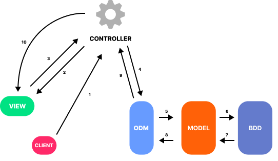

# API <!-- omit from toc -->

## Table of content <!-- omit from toc -->
 - [API](#api)
  - [Table of content](#table-of-content)

## MVC model
- `view` : The client interface
- `controller` : Receive instruction from the view/client, gets the information from the model, translates it then sends it to the view
- `model` : Interprete the database

## What is an API

API or Application programming interface allows different parts of application to communicate data to each other. Those APIs can be part of the same project, or completely different applications. 

An `end point` is the point of contact of an API. `End points` have `protocoles` who defines what the recquired inputs are and what you get in return. You also need to supply an API key so that the API can identify who is trying to access it. 

## What is a payload

## REST Architecture

## URL vs UI

## What is a route in an API

## ORM and ODM

## Middleware